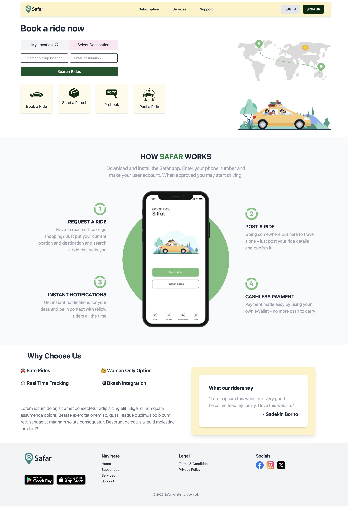

# 🚗 Safar - Ride Sharing Web Application

> **"Ride Till Death"** - Your ultimate companion for safe, reliable, and convenient transportation in Bangladesh.

## 📋 Table of Contents

- [About](#about)
- [Features](#features)
- [Technologies Used](#technologies-used)
- [Project Structure](#project-structure)
- [Getting Started](#getting-started)
- [Pages Overview](#pages-overview)
- [Screenshots](#screenshots)
- [Contributing](#contributing)
- [License](#license)
- [Contact](#contact)

## 🎯 About

Safar is a modern ride-sharing platform designed specifically for the Bangladeshi market. Our web application connects riders with drivers, offering a seamless transportation experience with features like real-time tracking, cashless payments through Bkash integration, and women-only ride options for enhanced safety.

### 🌟 Mission

To revolutionize urban transportation in Bangladesh by providing safe, affordable, and reliable ride-sharing services that connect communities and empower both riders and drivers.

## ✨ Features

### 🚘 Core Services

- **Book a Ride** - Instant ride booking with multiple vehicle options
- **Send a Parcel** - Parcel delivery service for quick shipments
- **Prebook** - Schedule rides in advance
- **Pool a Ride** - Share rides to reduce costs and environmental impact

### 🔒 Safety & Security

- **Women-Only Option** - Dedicated women-only rides for enhanced safety
- **Real-Time Tracking** - Live GPS tracking for all rides
- **Safe Rides** - Verified drivers and secure ride experiences
- **Instant Notifications** - Real-time updates and communication

### 💳 Payment & Convenience

- **Bkash Integration** - Seamless mobile payments
- **Cashless Transactions** - Multiple digital payment options
- **Transparent Pricing** - Clear fare structure with no hidden costs

### 📱 User Experience

- **Responsive Design** - Works perfectly on all devices
- **Modern UI/UX** - Clean, intuitive interface with smooth animations
- **Multi-language Support** - Designed for Bengali and English speakers

## 🛠️ Technologies Used

### Frontend

- **HTML5** - Semantic markup structure
- **CSS3** - Modern styling with custom animations
- **Tailwind CSS** - Utility-first CSS framework
- **JavaScript** - Interactive functionality
- **AOS (Animate On Scroll)** - Smooth scroll animations

### Design & Animation

- **Custom CSS Animations** - Smooth transitions and hover effects
- **Google Fonts (Poppins)** - Modern typography
- **Responsive Design** - Mobile-first approach

### Tools & Libraries

- **QuickChart.io** - Chart generation for dashboard
- **Font Awesome** - Icon library

## 🚀 Getting Started

### Prerequisites

- Web browser (Chrome, Firefox, Safari, Edge)
- Text editor (VS Code, Sublime Text, etc.)
- Node.js (for Tailwind CSS compilation)

### Installation

1. **Clone the repository**

   ```bash
   git clone https://github.com/fatin-israq/safar.git
   cd safar
   ```

2. **Install Tailwind CSS (if making changes)**

   ```bash
   npm install -D tailwindcss
   npx tailwindcss init
   ```

3. **Compile Tailwind CSS**

   ```bash
   npx tailwindcss -i ./src/css/input.css -o ./src/css/output.css --watch
   ```

4. **Open the application**

   ```bash
   # Simply open index.html in your browser or use a local server

   ```

5. **Visit the application**
   Open your browser and navigate to `http://127.0.0.1:5500/`

## 📄 Pages Overview

| Page                                                | Description                    | Key Features                            |
| --------------------------------------------------- | ------------------------------ | --------------------------------------- |
| **Homepage** (`index.html`)                         | Landing page with hero section | Service cards, animations, testimonials |
| **Dashboard** (`dashboard.html`)                    | Admin/Driver control panel     | Statistics, charts, ride management     |
| **Login** (`src/login.html`)                        | User authentication            | Animated form, responsive design        |
| **Sign Up** (`src/signup.html`)                     | User registration              | Multi-step form, validation             |
| **Terms & Conditions** (`src/termsNcondition.html`) | Legal terms                    | Comprehensive legal framework           |
| **Privacy Policy** (`src/privacy.html`)             | Data protection policy         | GDPR-compliant privacy information      |

## 📱 Screenshots

### 🏠 Homepage

_Modern landing page with intuitive ride booking interface_



- **Hero Section**: Eye-catching banner with instant ride booking
- **Service Cards**: Interactive cards for ride booking, parcel delivery, and more
- **How Safar Works**: Step-by-step guide with beautiful icons
- **Responsive Design**: Perfect adaptation across all device sizes

### 📊 Selecting Route


### 🔐 Payment

_Secure and elegant payment system_


### 📞 Customer Support

_Dedicated support system with modern design_


- **Multi-channel Support**: Phone, email, and chat options
- **FAQ Section**: Comprehensive help resources
- **Contact Forms**: Easy-to-use support request forms
- **Professional Layout**: Clean and organized interface

## 🎨 Design Features

### Color Scheme

- **Primary Green**: `#012B09`, `#75BF7A` - Trust and nature
- **Accent Amber**: `#FCD34D`, `#F59E0B` - Energy and warmth
- **Neutral Grays**: Various shades for text and backgrounds

### Typography

- **Primary Font**: Poppins - Modern, clean, and highly readable
- **Font Weights**: 100-900 for flexible design hierarchy

### Animations

- **Page Load**: Fade-in and slide-up animations
- **Hover Effects**: Scale transforms and color transitions
- **Scroll Animations**: AOS library for smooth reveals
- **Interactive Elements**: Button hovers and input focus states

## 🤝 Contributing

We welcome contributions to improve Safar! Here's how you can help:

1. **Fork the repository**
2. **Create a feature branch** (`git checkout -b feature/AmazingFeature`)
3. **Commit your changes** (`git commit -m 'Add some AmazingFeature'`)
4. **Push to the branch** (`git push origin feature/AmazingFeature`)
5. **Open a Pull Request**

### Contribution Guidelines

- Follow existing code style and structure
- Test your changes across different browsers
- Update documentation as needed
- Ensure responsive design principles

## 📞 Contact

**Safar Developer Team**

- **Email**: israqq2120@gmail.com
- **Address**: Bhatara, Dhaka, Bangladesh

---

<p align="center">
  <strong>Trying for a better solution</strong><br>
  <em>Connecting people, one ride at a time</em>
</p>

---

⭐ **If you found this project helpful, please give it a star!** ⭐
